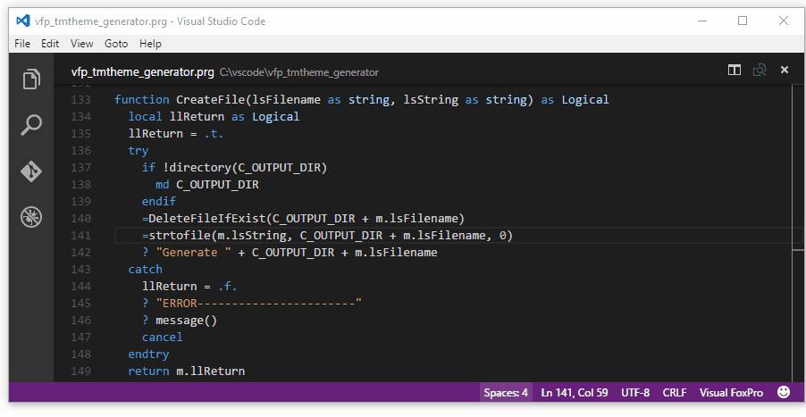

# A Visual FoxPro theme for **Visual Studio Code**

* Microsoft Visual Studio Code website: https://code.visualstudio.com/
* Visual FoxPro language Extension website: [GitHub](https://github.com/FrancisFaure/vfp_tmlanguage_generator)


## VFP Theme generator: Personalize your VS Code Theme (with VFP Extension for VS Code)

* If you want have more colors or personalize your theme:

Download [vfp_tmtheme_generator.prg](https://github.com/FrancisFaure/vfp_tmtheme_generator), personalize, run in vfp9, and click "Ok" to install.

The personalized theme looks like




## Uninstall

**vfp_tmtheme_generator.prg** : creates a uninstaller script: **"vfp_tmtheme\uninstall vfp theme.cmd"**
* which contains:
```
rd /S/Q %USERPROFILE%\.vscode\extensions\Theme-Dark-vfp\
```
(Another way using Windows Explorer is to delete **%USERPROFILE%\.vscode\extensions\Theme-Dark-vfp\**)


## License

[MIT](LICENSE) &copy; Francis FAURE


** Enjoy! **